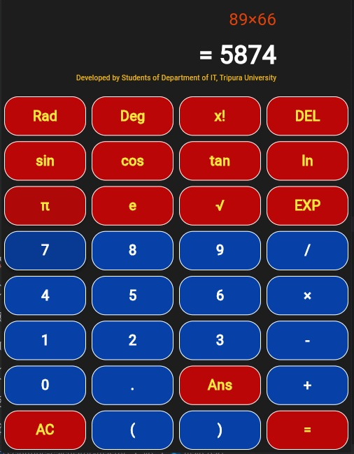

# Scientific Calculator

This is a scientific calculator application built using Flutter.



## Features

- Basic arithmetic operations: addition, subtraction, multiplication, and division.
- Advanced mathematical functions: trigonometric, logarithmic, exponential, and more.
- User-friendly interface with responsive design.
- Cross-platform compatibility: Android, iOS, Windows, macOS, Linux, and web.

## Installation

To run this project locally:

1. **Clone the repository:**

   ```bash
   git clone https://github.com/diptamandebnath/Scientific_Calculator.git
   ```

2. **Navigate to the project directory:**

   ```bash
   cd Scientific_Calculator
   ```

3. **Install dependencies:**

   ```bash
   flutter pub get
   ```

4. **Run the application:**

   ```bash
   flutter run
   ```

   Choose the desired platform when prompted.

## Screenshot

``

## Dependencies

This project uses the following Flutter packages:

- `flutter`: The Flutter framework.
- `cupertino_icons`: Provides iOS-style icons.

For a complete list of dependencies, refer to the `pubspec.yaml` file.

## Contributing

Contributions are welcome! To contribute:

1. Fork the repository.
2. Create a new branch for your feature or bug fix.
3. Commit your changes with descriptive messages.
4. Push your changes to your fork.
5. Submit a pull request detailing your changes.

## License

This project is licensed under the MIT License. See the `LICENSE` file for more information.

## Acknowledgements

Special thanks to all contributors and the Flutter community for their support.

---

For more information, visit the [GitHub repository](https://github.com/diptamandebnath/Scientific_Calculator).

